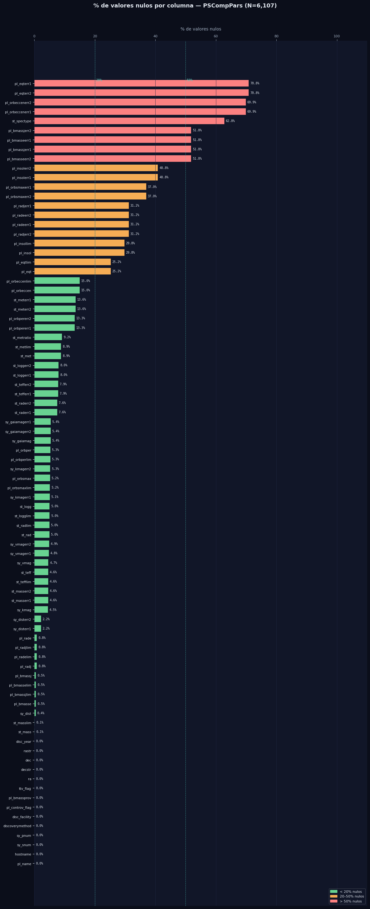
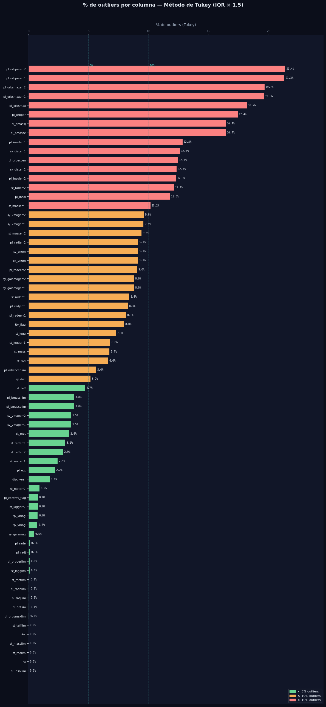

# Limpieza y preparación de datos

En este apartado se buscaran problemas relacionados a la falta de datos, datos atipicos, sesgos, etc, todo lo que pueda afectar nuestro analisis si no lo tratamos debidamente.

>PythonCode


```python
# ── Calcular % de nulos por columna ─────────────────────────────────────────
nulls = (df_raw.isnull().mean() * 100).sort_values(ascending=True)

# ── Color por umbral ─────────────────────────────────────────────────────────
def get_color(pct):
    if pct >= 50:
        return "#fc8181"   # rojo  — más de 50% nulos
    elif pct >= 20:
        return "#f6ad55"   # naranja — 20–50%
    else:
        return "#68d391"   # verde  — menos de 20%

colors = [get_color(p) for p in nulls.values]

# ── Figura ───────────────────────────────────────────────────────────────────
fig, ax = plt.subplots(figsize=(12, len(nulls) * 0.32 + 2))
fig.patch.set_facecolor("#0b0e1a")
ax.set_facecolor("#111628")

bars = ax.barh(nulls.index, nulls.values, color=colors, height=0.7, edgecolor="none")

# Etiquetas con el % al final de cada barra
for bar, val in zip(bars, nulls.values):
    ax.text(
        val + 0.5, bar.get_y() + bar.get_height() / 2,
        f"{val:.1f}%",
        va="center", ha="left",
        fontsize=7, color="#e2e8f0", fontfamily="monospace"
    )

# Líneas de referencia en 20% y 50%
for xline, label in [(20, "20%"), (50, "50%")]:
    ax.axvline(xline, color="#4fd1c5", linestyle="--", linewidth=0.8, alpha=0.6)
    ax.text(xline + 0.3, len(nulls) - 0.5, label,
            color="#4fd1c5", fontsize=8, va="top", fontfamily="monospace")

# Estilo de ejes
ax.set_xlim(0, 110)
ax.set_xlabel("% de valores nulos", color="#a0aec0", fontsize=10, labelpad=10)
ax.tick_params(axis="x", colors="#a0aec0", labelsize=8)
ax.tick_params(axis="y", colors="#e2e8f0", labelsize=7.5)
ax.spines[["top", "right", "left", "bottom"]].set_visible(False)
ax.grid(axis="x", color="#1e2540", linewidth=0.6)
ax.xaxis.tick_top()
ax.xaxis.set_label_position("top")

# Título
fig.suptitle(
    "% de valores nulos por columna — PSCompPars (N=6,107)",
    color="#e2e8f0", fontsize=13, fontweight="bold", y=1.01, x=0.5
)

# Leyenda
patches = [
    mpatches.Patch(color="#68d391", label="< 20% nulos"),
    mpatches.Patch(color="#f6ad55", label="20–50% nulos"),
    mpatches.Patch(color="#fc8181", label="> 50% nulos"),
]
ax.legend(handles=patches, loc="lower right", framealpha=0.2,
          labelcolor="#e2e8f0", fontsize=8, facecolor="#111628")

plt.tight_layout()

# ── Resumen en consola ───────────────────────────────────────────────────────
print(f"\nTotal columnas: {len(nulls)}")
print(f"  > 50% nulos:  {(nulls >= 50).sum()} columnas")
print(f"  20–50% nulos: {((nulls >= 20) & (nulls < 50)).sum()} columnas")
print(f"  < 20% nulos:  {(nulls < 20).sum()} columnas")
```





WOW, increible grafica, con esto podemos darnos cuenta de cuantas columnas con valores faltantes tenemos, afortunadamente nuestra variable de interes, **(pl_eqt)**, solo le falta el 25% de los dato, es decir, tenemos 75% de datos que si son relevantes.

Ahora, como podemos ver, hay variables que tienen 50% de los datos faltantes o incluso hay variables con 60 a 70 % de datos faltantes, y realmente con eso no podriamos trabajar ya que solo contariamos con el 20 -30% de los datos y no seria estadisticamente confiable trabajar con ellos, por lo tanto, definiremos que las variables con un porcentaje mayor al 50% seran automaticamente descartadas.

Aunado a esto, solo 12 columnas tienen valores nulos mayores al 50%, por lo cual no representaria un riesgo si las quitamos.


### Filtrar dataset por valores faltantes por columna

>PythonCode


```python
print(f"Shape original:  {df_raw.shape}  ({df_raw.shape[1]} columnas, {df_raw.shape[0]} filas)")

# ── Identificar y eliminar columnas con más del 50% de nulos ─────────────────
umbral = 0.50
nulos_pct = df_raw.isnull().mean()
cols_eliminar = nulos_pct[nulos_pct > umbral].index.tolist()

print(f"\nColumnas eliminadas ({len(cols_eliminar)}) — más del 50% de nulos:")
for col in cols_eliminar:
    print(f"  - {col:30s}  {nulos_pct[col]*100:.1f}%")

# ── Dataset limpio ────────────────────────────────────────────────────────────
df_clean = df_raw.drop(columns=cols_eliminar)

print(f"\nShape resultante: {df_clean.shape}  ({df_clean.shape[1]} columnas, {df_clean.shape[0]} filas)")
```


>Output



