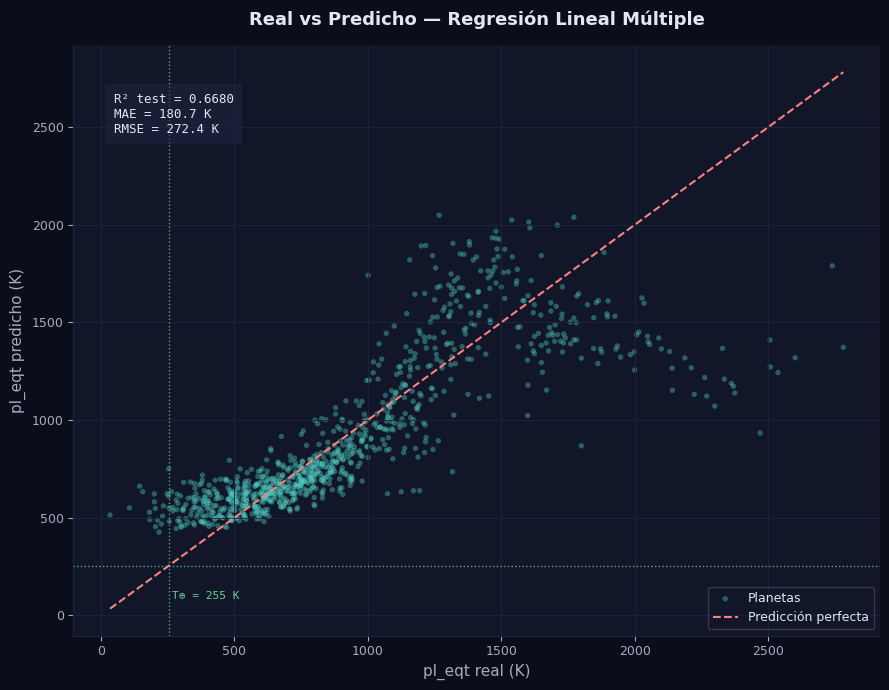
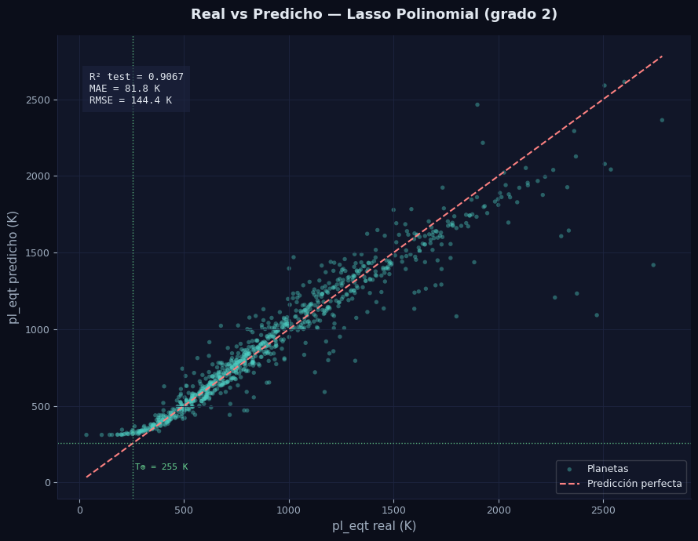

# Creación y comparación de modelos


## Modelo Lineal
En esta sección crearemos modelos lineales y no lineales para ver el desempeño de cada uno en los datos.


Continuando despues de la limpieza, ya tenemos los datos listos, ahora dividamos nuestros datos, probemos con 80% de los datos originales, esto para train y test.

Para esto usaremos OLS regression para ver los datos mas explicitos y scikit-learn para las métricas predictivas y calculos de test. 

Asi mismo despues de eso, grafiquemos los datos predichos vs los datos reales para ver la dispersion.


>PythonCode


```python
import statsmodels.api as sm
from sklearn.model_selection import train_test_split
from sklearn.linear_model import LinearRegression
from sklearn.metrics import mean_squared_error, mean_absolute_error, r2_score
import numpy as np

# ── Split ─────────────────────────────────────────────────────────────────────
X = df_model_clean.drop(columns="pl_eqt")
y = df_model_clean["pl_eqt"]

X_train, X_test, y_train, y_test = train_test_split(
    X, y, test_size=0.2, random_state=42
)

# ── Statsmodels OLS ───────────────────────────────────────────────────────────
X_train_sm = sm.add_constant(X_train)
X_test_sm  = sm.add_constant(X_test)

model_sm = sm.OLS(y_train, X_train_sm).fit()
print(model_sm.summary())

# ── Sklearn — métricas en test set ───────────────────────────────────────────
y_pred = model_sm.predict(X_test_sm)

r2   = r2_score(y_test, y_pred)
mae  = mean_absolute_error(y_test, y_pred)
rmse = np.sqrt(mean_squared_error(y_test, y_pred))

print("\n" + "=" * 50)
print("  MÉTRICAS EN TEST SET (datos no vistos)")
print("=" * 50)
print(f"  R²:   {r2:.4f}")
print(f"  MAE:  {mae:.2f} K")
print(f"  RMSE: {rmse:.2f} K")
print(f"  Observaciones train: {len(X_train)}")
print(f"  Observaciones test:  {len(X_test)}")


# Graficar

import matplotlib.pyplot as plt
import numpy as np

# ── Predicciones ──────────────────────────────────────────────────────────────
y_pred = model_sm.predict(X_test_sm)

# ── Gráfica ───────────────────────────────────────────────────────────────────
fig, ax = plt.subplots(figsize=(9, 7))
fig.patch.set_facecolor("#0b0e1a")
ax.set_facecolor("#111628")

# Scatter real vs predicho
ax.scatter(y_test, y_pred, alpha=0.4, s=15, color="#4fd1c5", edgecolors="none", label="Planetas")

# Línea perfecta (y = x)
lims = [min(y_test.min(), y_pred.min()), max(y_test.max(), y_pred.max())]
ax.plot(lims, lims, color="#fc8181", linewidth=1.5, linestyle="--", label="Predicción perfecta")

# Línea de la Tierra
ax.axvline(255, color="#68d391", linewidth=1, linestyle=":", alpha=0.8)
ax.axhline(255, color="#68d391", linewidth=1, linestyle=":", alpha=0.8)
ax.text(255 + 10, lims[0] + 50, "T⊕ = 255 K", color="#68d391", fontsize=8, fontfamily="monospace")

# Estilo
ax.set_xlabel("pl_eqt real (K)",      color="#a0aec0", fontsize=11)
ax.set_ylabel("pl_eqt predicho (K)",  color="#a0aec0", fontsize=11)
ax.set_title("Real vs Predicho — Regresión Lineal Múltiple",
             color="#e2e8f0", fontsize=13, fontweight="bold", pad=15)
ax.tick_params(colors="#a0aec0", labelsize=9)
ax.spines[["top", "right"]].set_visible(False)
ax.spines[["left", "bottom"]].set_color("#1e2540")
ax.grid(color="#1e2540", linewidth=0.6)
ax.legend(framealpha=0.2, labelcolor="#e2e8f0", fontsize=9, facecolor="#111628")

# Anotación R²
ax.text(0.05, 0.92, f"R² test = {r2:.4f}\nMAE = {mae:.1f} K\nRMSE = {rmse:.1f} K",
        transform=ax.transAxes, color="#e2e8f0", fontsize=9,
        fontfamily="monospace", verticalalignment="top",
        bbox=dict(facecolor="#1e2540", alpha=0.6, edgecolor="none", pad=6))

plt.tight_layout()
plt.savefig("real_vs_predicho.png", dpi=150, bbox_inches="tight", facecolor=fig.get_facecolor())
plt.show()

```


>Output


```text
                            OLS Regression Results                            
==============================================================================
Dep. Variable:                 pl_eqt   R-squared:                       0.677
Model:                            OLS   Adj. R-squared:                  0.676
Method:                 Least Squares   F-statistic:                     2544.
Date:                Thu, 19 Feb 2026   Prob (F-statistic):               0.00
Time:                        08:21:19   Log-Likelihood:                -25527.
No. Observations:                3652   AIC:                         5.106e+04
Df Residuals:                    3648   BIC:                         5.109e+04
Df Model:                           3                                         
Covariance Type:            nonrobust                                         
==============================================================================
                 coef    std err          t      P>|t|      [0.025      0.975]
------------------------------------------------------------------------------
const        319.1026     41.340      7.719      0.000     238.052     400.153
pl_insol       1.4290      0.020     70.826      0.000       1.389       1.469
st_teff        0.0184      0.010      1.899      0.058      -0.001       0.037
st_rad       191.7200     20.721      9.252      0.000     151.094     232.346
==============================================================================
Omnibus:                     1798.743   Durbin-Watson:                   1.977
Prob(Omnibus):                  0.000   Jarque-Bera (JB):            22644.448
Skew:                           2.029   Prob(JB):                         0.00
Kurtosis:                      14.504   Cond. No.                     5.39e+04
==============================================================================

Notes:
[1] Standard Errors assume that the covariance matrix of the errors is correctly specified.
[2] The condition number is large, 5.39e+04. This might indicate that there are
strong multicollinearity or other numerical problems.

==================================================
  MÉTRICAS EN TEST SET (datos no vistos)
==================================================
  R²:   0.6680
  MAE:  180.66 K
  RMSE: 272.41 K
  Observaciones train: 3652
  Observaciones test:  914
```




Wow, increible grafica, podemos de forma aproximada en temperaturas dentro del rango de [500 1500] Kelvin, el modelo predice bastante bien, , sin embargo en temperaturas mas extremas, el modelo presenta dificultades para las predicciones.

Ademas, las metricas nos dicen lo siguiente.


- R² = 0.677 — el modelo explica el 67.7% de la variabilidad en pl_eqt. Para datos astronómicos observacionales con ruido real, es un resultado muy respetable
- R² ajustado = 0.676 — prácticamente igual al R², lo que confirma que no hay variables innecesarias inflando el modelo
- F-statistic = 2544, p = 0.00 — el modelo en conjunto es estadísticamente significativo

- pl_insol con coef 1.43, p = 0.000, es el predictor más fuerte y significativo. Por cada unidad extra de insolación, pl_eqt sube 1.43 K
- st_rad con coef 191.72, p = 0.000, es muy significativo. Cada radio solar adicional de la estrella sube 191 K la temperatura del planeta
- st_teff con coef 0.018, p = 0.058, esta justo en el límite. No es significativa al 95% de confianza, su intervalo incluye el cero [-0.001, 0.037]

Consideraciones:

La tabla de OLS indica que hay una colinealidad numerica muy fuerte, tal vez debido a la relacion de algunas variables.

RMSE = 272 K, esto es un problema ya que si nuestra temperatura objetivo es de 255 K, y nuestro error rd fr 272 K, significaria que nuestro error es increiblemente alto para predecir.

En general el modelo es aceptable, pero presenta algunas dificultades para predecir.


### Predicciones con el modelo de regresion

Ya sabemos que nuestro modelo es realmente malo para predecir, pero veamos como hace las predicciones, tomemos un par de planetas los cuales conocemos su pl_eqt y tratemos de predecirlos de forma breve para ver como se comporta.

>PythonCode


```python
### Predicciones con el modelo de regresion

# ── Planetas cercanos a 255 K ─────────────────────────────────────────────────
rango_min = 200
rango_max = 320

# Agregar nombre del planeta y hostname del df_clean
df_habitables = df_clean.loc[df_model_clean.index, ["pl_name", "hostname"]].copy()
df_habitables["pl_eqt_real"]     = df_model_clean["pl_eqt"].values
df_habitables["pl_eqt_predicho"] = model_sm.predict(sm.add_constant(X))
df_habitables["diff_tierra"]     = (df_habitables["pl_eqt_real"] - 255).abs()

# Filtrar zona habitable
habitables = df_habitables[
    df_habitables["pl_eqt_real"].between(rango_min, rango_max)
].sort_values("diff_tierra")

print(f"Planetas en zona habitable térmica ({rango_min}–{rango_max} K): {len(habitables)}")
print(f"\nTop 20 más cercanos a 255 K (T⊕):")
print(habitables[["pl_name", "hostname", "pl_eqt_real", "pl_eqt_predicho", "diff_tierra"]].head(20).to_string(index=False))
```


>Output


```text

Planetas en zona habitable térmica (200–320 K): 159

Top 20 más cercanos a 255 K (T⊕):
      pl_name    hostname  pl_eqt_real  pl_eqt_predicho  diff_tierra
   HD 40307 g    HD 40307       255.00       550.605169         0.00
   TOI-1338 b  TOI-1338 A       254.65       677.706873         0.35
   TOI-2257 b    TOI-2257       256.00       481.128875         1.00
Kepler-1704 b Kepler-1704       253.80       750.816022         1.20
  HD 152843 c   HD 152843       253.08       899.734270         1.92
 Kepler-539 c  Kepler-539       253.00       610.746028         2.00
 Kepler-967 c  Kepler-967       258.00       569.388962         3.00
 Kepler-553 c  Kepler-553       251.00       588.525157         4.00
  HD 109286 b   HD 109286       259.40       633.816566         4.40
  Wolf 1069 b   Wolf 1069       250.10       455.402868         4.90
 Kepler-991 b  Kepler-991       260.00       518.938034         5.00
Kepler-1593 b Kepler-1593       260.00       560.035328         5.00
 TRAPPIST-1 e  TRAPPIST-1       249.70       552.898951         5.30
   HD 27969 b    HD 27969       261.00       673.602642         6.00
   TOI-7166 b    TOI-7166       249.00       462.863480         6.00
   TOI-1736 c    TOI-1736       249.00       698.128913         6.00
Kepler-1636 b Kepler-1636       248.00       623.211713         7.00
Kepler-1362 b Kepler-1362       248.00       551.915279         7.00
    WASP-47 c     WASP-47       247.00       644.056205         8.00
KIC 9663113 b KIC 9663113       264.00       633.123781         9.00
```


Vaya, si que es malo, es casi el doble de lo que se predice.

Pero bueno, para un primer acercamiento, se considera aceptable.


## Modelo No lineal


# Modelo NO lineal


Bien, ya que tenemos los datos bien limpios, construir un modelo ya es tecnicamente mas sencillo.

Para la sección de un modelo no lineal, probemos usar un modelo polinomial, para esto usaremos las 8 variables que teniamos en un principio.

Ahora, utilizaremos el metodo de lasso, el cual lleva a los coeficientes del modelo a 0, eliminando variables con poca importancia.

Como realmente no sabemos cual parametro es el mejor alpha para poder trabajar, encontraremos el mejor alpha con validación cruzada.

Posterioemente calculemos las metricas correspondientes en comparación con los demas modelos.


>PythonCode


```python
import numpy as np

# ── Construir dataset desde df_clean con todas las variables relevantes ────────
vars_all = ["pl_eqt", "pl_insol", "st_teff", "st_rad", "st_mass", 
            "st_logg", "pl_orbsmax", "pl_orbeccen"]

df_lasso = df_clean[vars_all].copy()

# Eliminar filas donde pl_eqt es nulo (variable objetivo)
df_lasso = df_lasso.dropna(subset=["pl_eqt"])

# Imputar nulos restantes con KNN
from sklearn.impute import KNNImputer
df_lasso = pd.DataFrame(
    KNNImputer(n_neighbors=5).fit_transform(df_lasso),
    columns=df_lasso.columns
)

# Transformación log1p a pl_insol
df_lasso["pl_insol"] = np.log1p(df_lasso["pl_insol"])

print(f"Shape: {df_lasso.shape}")
print(f"Nulos: {df_lasso.isnull().sum().sum()}")
```


>Output


```text
Shape: (4566, 8)
Nulos: 0
```

Aqui se imputaron los datos, ya que regresamos al dataset previo a los modelos, esto para encontrar las variables que teniamos en un principio y poder ver cuales pueden ser buenas variables para describir el comportamiento del modelo.


>PythonCode


```python
from sklearn.preprocessing import PolynomialFeatures, StandardScaler
from sklearn.linear_model import LassoCV
from sklearn.pipeline import Pipeline
from sklearn.model_selection import train_test_split
from sklearn.metrics import r2_score, mean_absolute_error, mean_squared_error
import numpy as np

X_lasso = df_lasso.drop(columns="pl_eqt")
y_lasso = df_lasso["pl_eqt"]

X_train_l, X_test_l, y_train_l, y_test_l = train_test_split(
    X_lasso, y_lasso, test_size=0.2, random_state=42
)

# ── Pipeline: Poly → Scaler → LassoCV ────────────────────────────────────────
pipeline = Pipeline([
    ("poly",   PolynomialFeatures(degree=2, include_bias=False)),
    ("scaler", StandardScaler()),
    ("lasso",  LassoCV(cv=5, max_iter=10000, random_state=42))
])

pipeline.fit(X_train_l, y_train_l)

# ── Métricas ──────────────────────────────────────────────────────────────────
y_pred_l = pipeline.predict(X_test_l)

r2_l   = r2_score(y_test_l, y_pred_l)
mae_l  = mean_absolute_error(y_test_l, y_pred_l)
rmse_l = np.sqrt(mean_squared_error(y_test_l, y_pred_l))

best_alpha = pipeline.named_steps["lasso"].alpha_

# ── Variables seleccionadas por Lasso ─────────────────────────────────────────
feature_names = pipeline.named_steps["poly"].get_feature_names_out(X_lasso.columns)
coefs         = pipeline.named_steps["lasso"].coef_
seleccionadas = [(name, coef) for name, coef in zip(feature_names, coefs) if coef != 0]

print("=" * 55)
print("  LASSO + POLINOMIAL (grado 2) + CV")
print("=" * 55)
print(f"  Mejor alpha:                  {best_alpha:.4f}")
print(f"  Términos polinomiales totales:{len(feature_names)}")
print(f"  Términos seleccionados:       {len(seleccionadas)}")
print(f"\n  R²:   {r2_l:.4f}")
print(f"  MAE:  {mae_l:.2f} K")
print(f"  RMSE: {rmse_l:.2f} K")

print(f"\n  Términos seleccionados (ordenados por |coef|):")
for name, coef in sorted(seleccionadas, key=lambda x: abs(x[1]), reverse=True):
    print(f"  {name:35s}  {coef:.4f}")

print("\n" + "=" * 55)
print("  COMPARACIÓN FINAL")
print("=" * 55)
print(f"  {'Modelo':30s}  {'R²':>8}  {'MAE':>8}  {'RMSE':>8}")
print(f"  {'Lineal (log insol + st_rad)':30s}  {0.7210:>8.4f}  {163.46:>8.2f}  {249.71:>8.2f}")
print(f"  {'Lasso Polinomial (todas)':30s}  {r2_l:>8.4f}  {mae_l:>8.2f}  {rmse_l:>8.2f}")
```


```text
=======================================================
  LASSO + POLINOMIAL (grado 2) + CV
=======================================================
  Mejor alpha:                  15.4855
  Términos polinomiales totales:35
  Términos seleccionados:       4

  R²:   0.9067
  MAE:  81.85 K
  RMSE: 144.40 K

  Términos seleccionados (ordenados por |coef|):
  pl_insol^2                           418.1614
  pl_insol st_rad                      8.7140
  pl_insol pl_orbsmax                  2.9128
  pl_insol pl_orbeccen                 2.8283

=======================================================
  COMPARACIÓN FINAL
=======================================================
  Modelo                                R²       MAE      RMSE
  Lineal (log insol + st_rad)       0.7210    163.46    249.71
  Lasso Polinomial (todas)          0.9067     81.85    144.40
```


En este modelo, parece que le fue bastante bien, podemos ver que tenemos una R^2 de 90%, es decir, el modelo polinomial combinado con el metodo de lasso, puede explicar bastante bien la variabilidad del conjunto de datos para esas variables en especifico.

Ahora nuestro error no es tan significativo en comparación con los demas modelos, pues solo tenemos un RMSE de 144.4 K, lo cual es mas que aceptable.


### Graficar predicciones vs valores reales


>PythonCode


```python
import matplotlib.pyplot as plt

y_pred_l = pipeline.predict(X_test_l)

fig, ax = plt.subplots(figsize=(9, 7))
fig.patch.set_facecolor("#0b0e1a")
ax.set_facecolor("#111628")

ax.scatter(y_test_l, y_pred_l, alpha=0.4, s=15, color="#4fd1c5", edgecolors="none", label="Planetas")

lims = [min(y_test_l.min(), y_pred_l.min()), max(y_test_l.max(), y_pred_l.max())]
ax.plot(lims, lims, color="#fc8181", linewidth=1.5, linestyle="--", label="Predicción perfecta")

ax.axvline(255, color="#68d391", linewidth=1, linestyle=":", alpha=0.8)
ax.axhline(255, color="#68d391", linewidth=1, linestyle=":", alpha=0.8)
ax.text(255 + 10, lims[0] + 50, "T⊕ = 255 K", color="#68d391", fontsize=8, fontfamily="monospace")

ax.set_xlabel("pl_eqt real (K)",     color="#a0aec0", fontsize=11)
ax.set_ylabel("pl_eqt predicho (K)", color="#a0aec0", fontsize=11)
ax.set_title("Real vs Predicho — Lasso Polinomial (grado 2)",
             color="#e2e8f0", fontsize=13, fontweight="bold", pad=15)
ax.tick_params(colors="#a0aec0", labelsize=9)
ax.spines[["top", "right"]].set_visible(False)
ax.spines[["left", "bottom"]].set_color("#1e2540")
ax.grid(color="#1e2540", linewidth=0.6)
ax.legend(framealpha=0.2, labelcolor="#e2e8f0", fontsize=9, facecolor="#111628")

ax.text(0.05, 0.92, f"R² test = {r2_l:.4f}\nMAE = {mae_l:.1f} K\nRMSE = {rmse_l:.1f} K",
        transform=ax.transAxes, color="#e2e8f0", fontsize=9,
        fontfamily="monospace", verticalalignment="top",
        bbox=dict(facecolor="#1e2540", alpha=0.6, edgecolor="none", pad=6))

plt.tight_layout()
plt.savefig("real_vs_predicho_lasso.png", dpi=150, bbox_inches="tight", facecolor=fig.get_facecolor())
plt.show()
```


>Output


