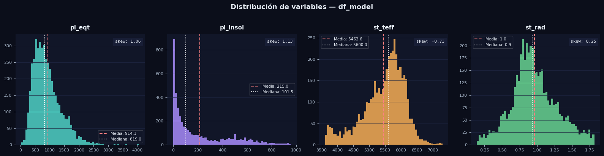
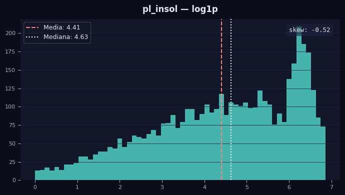

# What if ???

Esta seccion esta dedicada a explorar ciertos cambios que se hicieron en el dataset y los modelos, esto con el fin de ver como reacciona,
mas que nada por mera curiosidad y ver si en base a eso el modelo empeora o mejora.


Abarcaremos brevemente los siguiente escenarios:

#Seccion de What if?

1 - Qué pasaria si vieramos la distribución de los datos para encontrar alguna asimetria y corregirla, mejoraria el modelo?

2 - Qué tal si en vez de usar una seleccion de variables por contexto, buscamos la mejor combinacion de las variables para tratar de mejorarlo?

3 - Si creamos alguna interacción entre las variables, mejoraria el modelo?

4- si normalizamos los datos, el modelo mejoraria?


# 1) Ver distribucion

>PythoCode


```python
import matplotlib.pyplot as plt

fig, axes = plt.subplots(1, 4, figsize=(16, 4))
fig.patch.set_facecolor("#0b0e1a")

vars_plot = ["pl_eqt", "pl_insol", "st_teff", "st_rad"]
colors    = ["#4fd1c5", "#a78bfa", "#f6ad55", "#68d391"]

for ax, col, color in zip(axes, vars_plot, colors):
    ax.set_facecolor("#111628")
    data = df_model_clean[col].dropna()

    ax.hist(data, bins=60, color=color, alpha=0.85, edgecolor="none")

    # Media y mediana
    ax.axvline(data.mean(),   color="#fc8181", linewidth=1.5, linestyle="--", label=f"Media: {data.mean():.1f}")
    ax.axvline(data.median(), color="#fff",    linewidth=1.5, linestyle=":",  label=f"Mediana: {data.median():.1f}")

    ax.set_title(col, color="#e2e8f0", fontsize=11, fontweight="bold", pad=8)
    ax.tick_params(colors="#a0aec0", labelsize=8)
    ax.spines[["top", "right", "left", "bottom"]].set_visible(False)
    ax.grid(axis="y", color="#1e2540", linewidth=0.6)
    ax.legend(framealpha=0.2, labelcolor="#e2e8f0", fontsize=7.5, facecolor="#111628")

    # Skewness
    skew = data.skew()
    ax.text(0.97, 0.92, f"skew: {skew:.2f}", transform=ax.transAxes,
            color="#e2e8f0", fontsize=8, ha="right", fontfamily="monospace",
            bbox=dict(facecolor="#1e2540", alpha=0.6, edgecolor="none", pad=4))

fig.suptitle("Distribución de variables — df_model", color="#e2e8f0",
             fontsize=13, fontweight="bold", y=1.02)

plt.tight_layout()
plt.savefig("distribucion_variables.png", dpi=150, bbox_inches="tight", facecolor=fig.get_facecolor())
plt.show()
```


>Output



Claramente hay asimetria, pero solo en pl_insol, veamos como reacciona a una escala logaritmica


>PythonCode

```python
import numpy as np

df_model_log = df_model_clean.copy()
df_model_log["pl_insol"] = np.log1p(df_model_clean["pl_insol"])

X_log = df_model_log.drop(columns="pl_eqt")
y_log = df_model_log["pl_eqt"]

X_train_log, X_test_log, y_train_log, y_test_log = train_test_split(
    X_log, y_log, test_size=0.2, random_state=42
)

X_train_log_sm = sm.add_constant(X_train_log)
X_test_log_sm  = sm.add_constant(X_test_log)

model_log = sm.OLS(y_train_log, X_train_log_sm).fit()
print(model_log.summary())

y_pred_log = model_log.predict(X_test_log_sm)
r2_log   = r2_score(y_test_log, y_pred_log)
mae_log  = mean_absolute_error(y_test_log, y_pred_log)
rmse_log = np.sqrt(mean_squared_error(y_test_log, y_pred_log))

print("\n" + "=" * 50)
print("  COMPARACIÓN DE MODELOS")
print("=" * 50)
print(f"  {'':20s}  {'Original':>10}  {'Log(pl_insol)':>13}")
print(f"  {'R²':20s}  {r2:>10.4f}  {r2_log:>13.4f}")
print(f"  {'MAE (K)':20s}  {mae:>10.2f}  {mae_log:>13.2f}")
print(f"  {'RMSE (K)':20s}  {rmse:>10.2f}  {rmse_log:>13.2f}")


fig, ax = plt.subplots(figsize=(7, 4))
fig.patch.set_facecolor("#0b0e1a")
ax.set_facecolor("#111628")

data = np.log1p(df_model_clean["pl_insol"])

ax.hist(data, bins=60, color="#4fd1c5", alpha=0.85, edgecolor="none")
ax.axvline(data.mean(),   color="#fc8181", linewidth=1.5, linestyle="--", label=f"Media: {data.mean():.2f}")
ax.axvline(data.median(), color="#fff",    linewidth=1.5, linestyle=":",  label=f"Mediana: {data.median():.2f}")

skew = data.skew()
ax.text(0.97, 0.92, f"skew: {skew:.2f}", transform=ax.transAxes,
        color="#e2e8f0", fontsize=9, ha="right", fontfamily="monospace",
        bbox=dict(facecolor="#1e2540", alpha=0.6, edgecolor="none", pad=4))

ax.set_title("pl_insol — log1p", color="#e2e8f0", fontsize=12, fontweight="bold", pad=10)
ax.tick_params(colors="#a0aec0", labelsize=8)
ax.spines[["top", "right", "left", "bottom"]].set_visible(False)
ax.grid(axis="y", color="#1e2540", linewidth=0.6)
ax.legend(framealpha=0.2, labelcolor="#e2e8f0", fontsize=9, facecolor="#111628")

plt.tight_layout()
plt.savefig("distribucion_log_insol.png", dpi=150, bbox_inches="tight", facecolor=fig.get_facecolor())
plt.show()

```


>Output


```text
                            OLS Regression Results                            
==============================================================================
Dep. Variable:                 pl_eqt   R-squared:                       0.721
Model:                            OLS   Adj. R-squared:                  0.721
Method:                 Least Squares   F-statistic:                     3140.
Date:                Thu, 19 Feb 2026   Prob (F-statistic):               0.00
Time:                        08:49:12   Log-Likelihood:                -25258.
No. Observations:                3652   AIC:                         5.052e+04
Df Residuals:                    3648   BIC:                         5.055e+04
Df Model:                           3                                         
Covariance Type:            nonrobust                                         
==============================================================================
                 coef    std err          t      P>|t|      [0.025      0.975]
------------------------------------------------------------------------------
const       -180.5310     38.128     -4.735      0.000    -255.285    -105.777
pl_insol     220.3967      2.757     79.947      0.000     214.992     225.802
st_teff       -0.0019      0.009     -0.215      0.830      -0.020       0.016
st_rad       135.5361     19.377      6.995      0.000      97.546     173.526
==============================================================================
Omnibus:                     2280.419   Durbin-Watson:                   2.002
Prob(Omnibus):                  0.000   Jarque-Bera (JB):            35235.261
Skew:                           2.720   Prob(JB):                         0.00
Kurtosis:                      17.211   Cond. No.                     5.38e+04
==============================================================================

Notes:
[1] Standard Errors assume that the covariance matrix of the errors is correctly specified.
[2] The condition number is large, 5.38e+04. This might indicate that there are
strong multicollinearity or other numerical problems.

==================================================
  COMPARACIÓN DE MODELOS
==================================================
                          Original  Log(pl_insol)
  R²                        0.6680         0.7210
  MAE (K)                   180.66         163.46
  RMSE (K)                  272.41         249.71
```


Vaya, si mejoró, no mucho pero mejoró.

R^2 ahora explica el 72.1 % de los datos originales

El error bajo de 272 K a 250 K.





